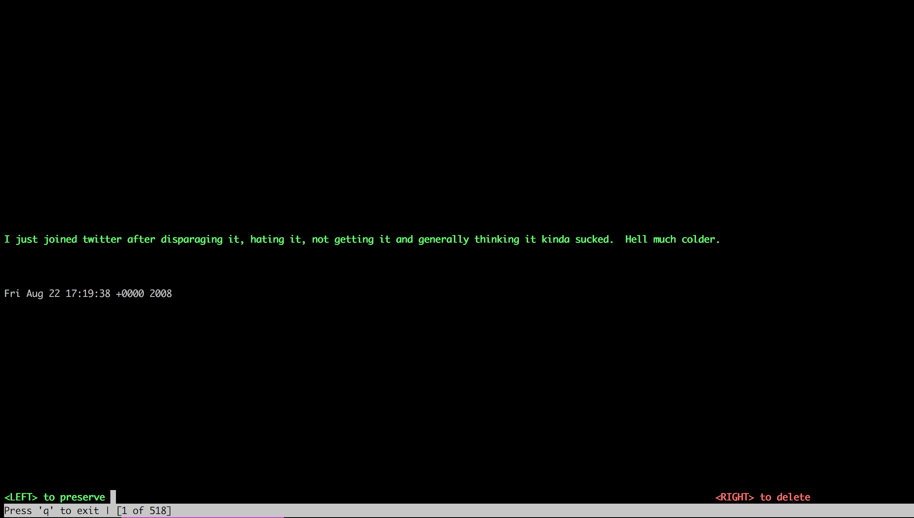

# Twitter Exporter

You've decided to quit or cut down your Twitter footprint. Here's some help.

Export your data export by [exporting your tweet archive](https://twitter.com/settings/account).

You're on your way. That's where this code comes in.

1. Use `export_tweets.js` to pull all your tweets into files
2. Use `query.py` to use a menu based interface to decide which to delete and
   built a list of Tweet IDs that are deletable
3. _Use that list to API-delete the tweets (Under development)_

## Requirements

You must have NodeJS installed. `brew install nodejs` usually does the trick on
Macs.

## Process

1. clone this repo to a local machine and `cd` into it
1. put the file `tweet.js`, from your tweet archive export into the local clone
1. run `./export_tweets.js`
1. Look in `converted_tweets`

```text
converted_tweets
├── 2008
│   ├── 08
│   │   ├── 22
│   │   │   ├── 2008-08-22-895722280.tweet.json
│   │   │   ├── 2008-08-22-895741518.tweet.json
│   │   │   ├── 2008-08-22-895834676.tweet.json
│   │   │   ├── 2008-08-22-895999543.tweet.json
│   │   │   ├── 2008-08-22-896021129.tweet.json
│   │   │   ├── 2008-08-22-896076861.tweet.json
```

```json
$ more ./converted_tweets/2008/08/22/2008-08-22-895722280.tweet.json
{"coordinates":null,"retweeted":false,"source":"<a href=\"http://twitter.com\" rel=\"nofollow\">Twitter Web Client</a>","entities":{"hashtags":[],"symbols":[],"user_mentions":[],"urls":[]},"display_text_range":["0.0","128.0"],"favorite_count":"0.0","in_reply_to_status_id_str":null,"geo":null,"id_str":"895722280","in_reply_to_user_id":null,"truncated":false,"retweet_count":"0.0","id":"8.9572228E8","in_reply_to_status_id":null,"created_at":"Fri Aug 22 17:19:38 +0000 2008","place":null,"favorited":false,"full_text":"I just joined twitter after disparaging it, hating it, not getting it and generally thinking it kinda sucked.  Hell much colder.","lang":"en","contributors":null,"in_reply_to_screen_name":null,"in_reply_to_user_id_str":null}
```

With your tweets split up like this, you can feel secure that you can go
through deleting your history at Twitter.

## Advice

Having split up my archive, I put the information in git. I'd recommend you do
the same.

## Decide what to Keep and Delete

`./query.py (subdir)` e.g. `./query.py 2008`



_My First Tweet: time to go!_


Hat Tip: [Clayton McCloud's ncurses demo](https://gist.github.com/claymcleod/b670285f334acd56ad1c)

Here I'm going to find all the exported tweets in `2008`. I could do `2008/08`.
The goal is to make deleting easy. We use a dating app like interface to
arrange Death + Our tweet.

* **RIGHT**: Adds the tweet id to `deletables.txt` which we can feed to the
  twitter API to do the finale remove later. **THIS ALSO DELETES THE FILE FROM
  LOCAL STORAGE**
* **LEFT**: Adds the tweet id to `deletables.txt` which we can feed to the
  twitter API to do the finale remove later. This **DOES NOT** remove the local
  file. You might reuse this content for a book, or a scrapbook, or import into
  come other CMS.

**CAVEAT**: This menu is not very smart and may not work (right, at all) in
narrow widths. Should be fine at 80 x 40. This is write-once code. Bugs and
snarly code to be expected.

## Next Steps for Deleters

Once you have a list of deletable IDs, you can use `twitter_rm.py` to process
your `deletable.txt` file (full of Tweet ids) and delete them.

In order to do so you'll need to acquire **4** developer tokens from Twitter as
documented at
[python-twitter](https://python-twitter.readthedocs.io/en/latest/getting_started.html).

I stored mine in a file called `secrets`, but the variables you should export into the
shell are

```text
CONSUMER_KEY
CONSUMER_SECRET
ACCESS_TOKEN
ACCESS_TOKEN_SECRET
```

So in my case I do `source secrets && PYTHONUNBUFFERED=1 ./twitter_rm.py |tee deletions.log`.

The code after the `&&` just makes the logging faster and stores it to a logfile. A plain
old `./twitter_rm.py` would work too.

